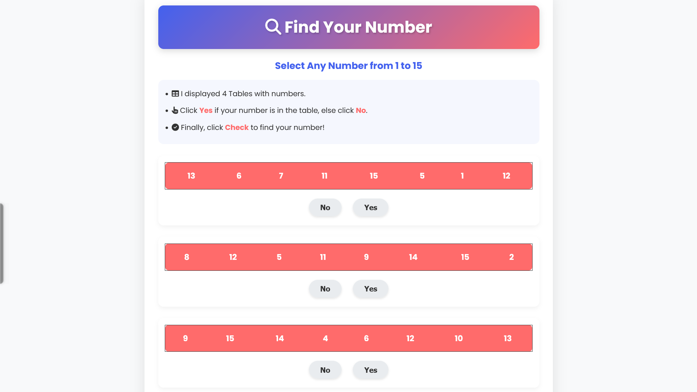

# 🔍 Find My Number Game

## [🎮 Play the Game](https://sainath-666.github.io/FindMyNumber_Game//)

## 📝 About the Game

Find My Number is an interactive guessing game where the computer will guess the number you've chosen between 1 and 15. The game uses a clever binary algorithm to determine your number based on your responses.

## 🎯 How to Play

1. Think of a number between 1 and 15
2. Four tables with numbers will be displayed one by one
3. Click "Yes" if your number appears in the table, otherwise click "No"
4. After answering for all four tables, click "Check" to see your number
5. To play again, click "Restart"

## 🛠️ Technologies Used

- HTML5
- CSS3 with modern design principles
- JavaScript (ES6+)
- Responsive design for all devices
- Font Awesome for icons
- Google Fonts for typography

## ✨ Features

- Modern and responsive UI
- Animated elements for better user experience
- Works on all devices (desktop, tablet, mobile)
- Simple and intuitive gameplay
- Elegant result display

## 🧠 How It Works

The game uses binary logic to determine your number. Each table represents a binary digit position (2³, 2², 2¹, 2⁰). Based on your yes/no answers, the program calculates the binary representation of your number and converts it to decimal.

## 🔗 Connect with Me

---

  
Made with ❤️ by Sainathreddy

